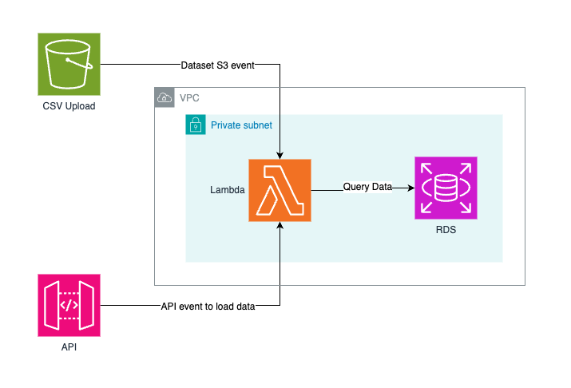

# Raft Terraform AWS Challenge

This repository provides you with a modular skeleton terraform directory tree to go off of for the challenge requirements below. 

## Prerequisite
- An active AWS Account (Free Tier is sufficient)
- Terraform CLI
- AWS CLI

## Requirements
Your mission should you choose to accept is to create a serverless application in AWS using Terraform. The Terraform configuration should create a RDS database, S3 bucket, Lambda function and any other necessary infrastructure components. The microservice will pull a sample dataset from a file stored in S3 to RDS and provide an API to view the data.

It is recommended to use this dataset from the OpenSky Network https://zenodo.org/record/5377831, but any dataset may be used.
- Create Terraform module(s) that will provision a RDS database, S3 bucket, Lambda microservice, and any other required components for access.
- Write a Lambda microservice using Python3.10+ that consumes any files uploaded to a designated S3 bucket and ingests them into an RDS database.
- Write a Lambda API endpoint that provides a JSON summary of the data, including how many rows are ingested and other useful metrics. If the provided dataset is used, these metrics could look like:
  - row_count: The number of rows in the RDS table for the dataset
  - last_transponder_seen_at: The maximum value for `lastseen` in the data
  - most_popular_destination: The most commonly seen value for `destination`
  - count_of_unique_transponders: a unique count of the `icao24` field
- Write a basic shell script that uses the Terraform & AWS CLIs to initialize, provision and deploy these resources. **It should also handle uploading the chosen dataset to S3 after completion.** The script should be something simple enough to include within CICD execution block (ex: a `.gitlab-ci.yml` “script” block).

## Deliverable
- The repo should have a good README explanation for us to get the project running on our own AWS account and review the assignment.
- We will run the project using the startup script provided. Everything should be deployed with this one command or otherwise be explained in the README.
- Instructions on how to access the summary API once it has been deployed.
- A GitHub repo with read permissions given to GitHub users `bsneider`, `seanps8` - [how to invite collaborators](https://docs.github.com/en/repositories/managing-your-repositorys-settings-and-features/managing-repository-settings/managing-teams-and-people-with-access-to-your-repository#inviting-a-team-or-person)

We look forward to discussing your solution and the technical choices you made!
  
## Architecture Diagram

Below is a high-level architecture diagram of the flow of events, and AWS resources:

*Note: Use of API Gateway is not a requirement, can be any API that displays the final output.*

